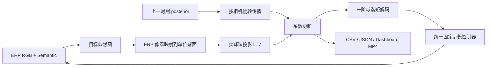

# EAGOR 球面信念场复现：组会汇报与论文说明

最新补充：[统一 Oracle Stop 诊断（100 个新 episode）](STOP_DIAGNOSIS_10SCENES_CN.md)。Oracle Stop 下 EAGOR/Grid/Centroid 各 4/10，GT Direction 6/10，无方向探索 2/10；原 Area 下仅 Centroid 1/10。共同任务未观察到 EAGOR 到达效率优势。完整停止分类、失败几何证据、配对视频见该报告，以下早期结果保留原实验范围。

> 文档状态：2026-08-17，本地阶段性实验报告  
> 对应论文：[EAGOR: Embodied Reasoning in Omni-direction](https://arxiv.org/abs/2607.06165)（arXiv:2607.06165v1）  
> 技术实现细节：[README.md](README.md)  
> Phase 1–4 导航归因：[FAILURE_ATTRIBUTION_PHASE1_4_CN.md](FAILURE_ATTRIBUTION_PHASE1_4_CN.md)  
> 10 场景修正版归因：[FAILURE_ATTRIBUTION_10SCENES_CN.md](FAILURE_ATTRIBUTION_10SCENES_CN.md)  
> 2026-09-11 新增在线建图/Frontier/A* 实验与视频：[ONLINE_NAVIGATION_10SCENES_CN.md](ONLINE_NAVIGATION_10SCENES_CN.md)  
> 本文用途：组会汇报、实验留档，以及论文“方法复现 / 诊断实验 / 局限性”部分的初稿素材

## 0. 结论先行

**2026-09-11 更新：** 保持 SH-BF 不变，新单层在线地图与规划执行使 GT Direction + Oracle Stop 达到 6/10；统一原 Area 后 EAGOR/Grid/GT Direction/无方向探索为 0/10、Centroid 为 1/10。两个共同任务的停止干预确认漏停问题。全部使用 GT pose 和 Oracle Semantic，不能称为完全无特权系统；最新完整表格、同批任务恢复、真实门洞/绕障/失败视频和图表插入位置见[新报告](ONLINE_NAVIGATION_10SCENES_CN.md)。下文早期结果保留其原实验范围。

本项目完成了 EAGOR 核心 **Spherical Harmonic Belief Field（SH-BF）** 的独立实现，并将其接入 Habitat-Lab / Habitat-Sim。当前结果支持三个结论：

1. 球谐信念场能够在 ERP 全景的左右接缝处连续表达方向概率，并在纯旋转和短时遮挡下传播历史观测。
2. 在 ReplicaCAD Oracle 语义上，系统完成了 333 步、约 39.93 m 的长时序电视搜索；目标直到第 324 步才首次出现，说明当前管线确实能够录制和分析长时序搜索过程。
3. 在 3 个 MP3D ObjectNav 场景的 12 次四策略对比中，所有策略成功率均为 0。EAGOR 的方向预测比普通质心更稳定，但未优于 Grid 的平均角误差，且推理更慢。这一结果说明：**方向信念本身不是可通行路径规划器**，多实例目标、障碍物、停止判据和感知误差仍会导致失败。
4. 10-scene 归因进一步发现：GT direction + direct controller 仍为 0/10，单帧 depth local planner 仍为 0/10，而修正后的 Habitat 离散 navmesh follower 达到 10/10、SPL=0.978、0 碰撞。当前最强瓶颈是 global/path reachability，不应先修改 SH-BF。旧的 row-I SR=0.667 是 heading-only follower 的实现偏差，已由新报告取代。

因此，当前工作应描述为“核心 belief field 的复现与诊断”，不能描述为“完整复现论文最终导航性能”或“达到论文/SOTA结果”。

## 1. 研究问题

全景具身导航每一步都会接收一张 ERP（equirectangular panorama）图像。目标物体可能：

- 横跨 ERP 左右边界；
- 短暂被遮挡或离开视野；
- 在多个方向同时出现；
- 因智能体转动而改变相对方位；
- 因智能体平移而产生视差；
- 只给出“应该朝哪里走”的方向，却没有给出绕开障碍的路线。

普通二维质心在 ERP 接缝处会产生错误平均。EAGOR 的核心思路是把每帧目标似然投影到球谐函数空间，在球面上旋转和累积信念，再从低阶球谐矩恢复目标方向。

本复现重点回答：

1. SH-BF 的球面投影、旋转传播和更新能否按论文公式运行？
2. 它是否能修复 ERP 接缝并增强时间稳定性？
3. 当它接入真实 Habitat ObjectNav 长时序闭环后，还会在哪里失败？

## 2. 论文方法、本项目补全与尚未完成部分

| 范围 | 当前状态 | 说明 |
|---|---:|---|
| ERP 像素到单位球面映射 | 已实现 | 使用像素中心和球面面积权重 |
| 实球谐投影，最大阶数 \(L=7\) | 已实现 | 共 \((L+1)^2=64\) 个系数 |
| 基于智能体旋转的 belief 传播 | 已实现 | 平面 yaw 使用系数块旋转，一般 SO(3) 使用重采样投影 |
| 论文式加性系数更新 | 已实现 | 同时保留可选衰减更新用于诊断 |
| 一阶球谐矩方向解码 | 已实现 | 对论文置信度公式的歧义做了显式记录 |
| 四策略统一评测 | 已实现 | Centroid、Circular Centroid、Grid、EAGOR |
| Habitat ERP、日志、指标和视频 | 已实现 | 每步输出可视化 dashboard、CSV 和 JSON |
| MP3D ObjectNav 接入 | 已实现 | 90 个场景和 v1 episodes 已通过预检；本阶段抽取 3 个唯一场景 |
| Oracle 语义感知 | 已实现 | 用于隔离 belief/controller 问题，是调试上界，不是 zero-shot 结果 |
| Qwen 本地 grounding 接口 | 已实现接口 | 尚未形成可用于论文比较的大规模 VLM 结果 |
| 论文原始 benchmark 完整复现 | 未完成 | 论文主文未披露全部场景/episode协议，arXiv 当前无补充材料，官方代码尚未发现 |
| HM3D/HOS/OSR-Bench 正式结果 | 未完成 | 数据与任务协议仍需补齐 |

> **口径要求：** 下文凡写“论文报告”，均指作者论文中的数字；凡写“本地实验”，均指当前仓库产生的结果。两者协议不同，不做直接数值对齐。

## 3. 系统总览

<!-- ===== 图 1 插入位置：系统方法总览 ===== -->

> **【图 1 插入位置：EAGOR 复现系统总览】**
>
> - 当前可用草图：下方 Mermaid 流程图。
> - 论文版本建议文件名：`figures/eagor_system_overview.pdf`。
> - 组会版本建议：把“观测—球面投影—belief 更新—方向解码—动作—新观测”做成逐步动画。
> - 建议图注：*系统接收 ERP RGB/semantic 观测，将目标似然投影为球谐系数；上一时刻 belief 根据位姿旋转到当前视角，与当前观测相加，再解码目标方向并交给统一离散控制器。*



运行时信息流为：

```text
ERP 图像/Oracle semantic/录制似然/可选 Qwen
                    ↓
             目标 likelihood [0,1]
                    ↓
       球面采样 + 立体角加权 + 实球谐投影
                    ↓
       旋转传播的历史系数 + 当前观测系数
                    ↓
          目标方向、置信度、离散导航动作
                    ↓
      原始日志、episode 摘要、指标图和调试视频
```

## 4. 核心方法

### 4.1 ERP 到球面

对宽度 \(W\)、高度 \(H\) 的 ERP 图像，像素 \((u,v)\) 对应的方位角、仰角和单位方向为：

$$
\theta=\frac{2\pi u}{W}-\pi,\qquad
\phi=\frac{\pi}{2}-\frac{\pi v}{H},
$$

$$
\boldsymbol{\omega}
=\left(\cos\phi\cos\theta,\ \cos\phi\sin\theta,\ \sin\phi\right).
$$

本项目内部坐标约定为 \(+x\) 向前、\(+y\) 向左、\(+z\) 向上，正方位角表示左转。Habitat 原生 ERP 的水平方向与该约定相反，因此 RGB 和 semantic 观测会统一水平翻转一次。

ERP 的每个像素并不具有相等球面面积。投影使用精确纬度带立体角权重，全部像素权重之和为 \(4\pi\)，从而避免极区被二维像素数量过度加权。

### 4.2 似然到球谐系数

感知模块输出目标似然 \(\ell_t(\boldsymbol{\omega})\in[0,1]\)。论文采用对数证据：

$$
r_t(\boldsymbol{\omega})=\log\left(\ell_t(\boldsymbol{\omega})+\epsilon\right).
$$

使用最大阶数 \(L=7\) 的实球谐基底：

$$
r_t(\boldsymbol{\omega})\approx
\sum_{l=0}^{L}\sum_{m=-l}^{l}b_{t,lm}Y_{lm}(\boldsymbol{\omega}),
$$

共得到 64 个系数。离散投影显式乘以每个 ERP 像素的球面面积权重。

### 4.3 历史 belief 的旋转传播

智能体发生旋转后，旧 belief 必须转换到当前观察坐标系。若 \(R_{WB,t}\) 表示当前 body 到世界的旋转，则：

$$
R_{t\leftarrow t-1}=R_{WB,t}^{\mathsf T}R_{WB,t-1}.
$$

本实现对 planar yaw 使用实球谐系数的精确块旋转；任意 SO(3) 则先旋转球面采样方向，再重新投影。四次 \(90^\circ\) 转动后能够回到原方向，正负 yaw 符号也有单元测试覆盖。

### 4.4 系数更新

论文式更新为：

$$
\mathbf c_1=\mathbf b_1,\qquad
\mathbf c_t=\widetilde{\mathbf c}_{t-1}+\mathbf b_t,
$$

其中 \(\widetilde{\mathbf c}_{t-1}\) 是旋转到当前观察坐标系的历史系数。该形式会持续累积相同观测，因此本项目另外实现衰减版本用于分析，但论文式实验默认不擅自修改更新规则。

### 4.5 方向解码与控制

方向由 degree-1 球谐系数对应的一阶球面矩解码。当前实现同时提供 paper decode 和 probability decode，避免把论文置信度公式中的歧义隐藏在代码里。

控制器只接收预测方向，并使用同一组 `turn_left`、`turn_right`、`move_forward`、`stop` 规则驱动所有四种 belief 策略。因此四策略之间的差异来自 belief 表达，而非不同控制器。

需要强调：方向解码回答的是“目标大概在哪个方向”，不是“哪条路径可行”。它不显式表示墙体、门、楼层、可通行区域或拓扑路径。

## 5. 代码对应关系

| 功能 | 入口文件 |
|---|---|
| 球面网格和面积权重 | [`spherical/spherical_grid.py`](spherical/spherical_grid.py) |
| 实球谐基底与投影 | [`spherical/spherical_harmonics.py`](spherical/spherical_harmonics.py) |
| 球谐旋转 | [`spherical/rotation.py`](spherical/rotation.py) |
| belief 传播、更新和解码 | [`spherical/belief_filter.py`](spherical/belief_filter.py) |
| EAGOR 策略 | [`policies/eagor_policy.py`](policies/eagor_policy.py) |
| 三个比较基线 | [`policies/centroid_policy.py`](policies/centroid_policy.py)、[`policies/circular_centroid_policy.py`](policies/circular_centroid_policy.py)、[`policies/grid_belief_policy.py`](policies/grid_belief_policy.py) |
| 固定步长控制器 | [`controllers/fixed_step_controller.py`](controllers/fixed_step_controller.py) |
| Oracle semantic likelihood | [`perception/oracle_semantic_backend.py`](perception/oracle_semantic_backend.py) |
| Qwen grounding 接口 | [`perception/qwen_grounding_backend.py`](perception/qwen_grounding_backend.py) |
| Habitat 评测循环 | [`evaluation/habitat_evaluator.py`](evaluation/habitat_evaluator.py) |
| Dashboard 视频 | [`evaluation/video_renderer.py`](evaluation/video_renderer.py) |
| MP3D 配置 | [`../configs/eagor/mp3d_oracle.yaml`](../configs/eagor/mp3d_oracle.yaml) |
| belief 弱点诊断 | [`scripts/analyze_belief_weaknesses.py`](scripts/analyze_belief_weaknesses.py) |
| 全部测试 | [`scripts/run_tests.py`](scripts/run_tests.py) |

## 6. 数据和实验状态

| 数据/任务 | 状态 | 当前用途 |
|---|---:|---|
| ReplicaCAD | 可运行 | 长时序成功案例与管线验证 |
| MP3D Habitat scenes | 90 场景已解压 | 多场景 ObjectNav 闭环测试 |
| MP3D ObjectNav v1 episodes | 已安装并通过预检 | 当前三场景四基线实验 |
| HM3D ObjectNav | 当前不可用 | 后续正式规模评测 |
| HOS / H\*Bench | 尚未接入 | 论文级开放词汇对象搜索 |
| OSR-Bench | 尚未接入 | 后续开放集评测 |

MP3D 数据位置：

```text
/media/xiaotian/ACD525D1B7A093D9/robot_nav_data/vln/data/scene_datasets/mp3d
/media/xiaotian/ACD525D1B7A093D9/robot_nav_data/vln/data/datasets/objectnav/mp3d/v1
```

原始压缩包：

```text
/media/xiaotian/ACD525D1B7A093D9/robot_nav_data/vln/downloads/mp3d_habitat.zip
```

## 7. 实验协议

### 7.1 四个 belief 策略

| 策略 | 表达方式 | 主要预期 |
|---|---|---|
| Centroid | 直接计算二维似然质心 | 简单，但会在 ERP 接缝处失败 |
| Circular Centroid | 水平角使用圆周均值 | 修复水平接缝，但缺少完整时间 belief |
| Grid | 在 ERP 网格上维护 belief | 保留多峰，但网格传播和极区加权存在代价 |
| EAGOR | 球谐系数上的球面 belief | 球面连续、可旋转传播、固定维度 |

所有策略使用相同的：

- ERP 分辨率：256 × 512；
- Oracle semantic 输入；
- 离散动作空间和固定步长控制器；
- 最长 300 步；
- 10 FPS、1280 × 720 dashboard 视频；
- 低置信度探索和碰撞恢复规则。

其中低置信度探索和碰撞恢复是为了形成闭环视频加入的**目标无关工程补全**，不是论文中已验证的模块。Oracle semantic 使用真值语义产生目标像素，但目标真值方向只用于离线计算误差，不输入控制器。

多实例类别的方向误差取当前有效目标实例中的最小角误差。这能避免评测端错误惩罚“朝向另一个同类别实例”，但并不能解决控制器在多个实例之间来回切换的问题。

### 7.2 当前 MP3D 子集

| 场景 | 目标类别 | 四策略视频 |
|---|---|---:|
| `EU6Fwq7SyZv` | cabinet | 4 |
| `2azQ1b91cZZ` | cabinet | 4 |
| `8194nk5LbLH` | gym_equipment | 4 |

当前只有 3 个唯一场景，适合形成可解释的诊断案例，不足以做统计显著的 benchmark 结论。

## 8. 可视化结果

### 8.1 ReplicaCAD：长时序搜索成功案例

<!-- ===== 图 2 插入位置：长时序首次检测帧 ===== -->

> **【图 2 插入位置：长时序成功案例的首次目标检测帧】**
>
> - 当前素材：下图。
> - 建议图注：*ReplicaCAD Oracle 语义实验。智能体在约 39.21 m、324 步后首次观测到 television，随后在约 39.93 m 处停止；全程 333 帧，无碰撞。*
> - 要证明的内容：当前系统不是短片段单元测试，而是能够运行、记录和解释长时序闭环搜索。
> - 不能证明的内容：Oracle 案例不能证明 zero-shot VLM 感知能力。


<!-- ===== 视频 A 插入位置：ReplicaCAD 长时序成功视频 ===== -->

> **【视频 A 插入位置：ReplicaCAD 333 帧完整搜索】**
>
> - [▶ 播放 MP4：apt_0_television_long_search.mp4](../eagor_outputs/long_object_search/apt_0_television_long_search.mp4)
> - 时长：33.3 s（10 FPS）。
> - 组会建议：先播放开头 5 s，再跳到约 31–33 s 展示首次发现和停止。
> - 论文补充材料建议文件名：`video_s1_replicacad_long_search.mp4`。

### 8.2 MP3D：EAGOR dashboard

<!-- ===== 图 3 插入位置：MP3D dashboard 示例 ===== -->

> **【图 3 插入位置：MP3D EAGOR 单步 dashboard】**
>
> - 当前素材：下图。
> - 建议图注：*MP3D ObjectNav 的 EAGOR 调试面板，同时显示 ERP RGB、目标似然、当前 spherical belief、历史方向、动作和 episode 统计。*
> - 组会讲法：先解释四个区域各自表示什么，再播放对应视频观察 belief 如何随旋转、遮挡和重复观测变化。


<!-- ===== 视频 B 插入位置：MP3D EAGOR 三场景 ===== -->

> **【视频 B 插入位置：MP3D 三场景 EAGOR 完整轨迹】**
>
> - [▶ `EU6Fwq7SyZv` / cabinet / 300 帧](../eagor_outputs/mp3d_objectnav_multiscene/eagor/videos/episode_EU6Fwq7SyZv_0.mp4)
> - [▶ `2azQ1b91cZZ` / cabinet / 300 帧](../eagor_outputs/mp3d_objectnav_multiscene/eagor/videos/episode_2azQ1b91cZZ_0.mp4)
> - [▶ `8194nk5LbLH` / gym_equipment / 300 帧](../eagor_outputs/mp3d_objectnav_multiscene/eagor/videos/episode_8194nk5LbLH_0.mp4)
> - 论文补充材料建议：保留一个正常长序列、一个多实例歧义序列、一个障碍/停止失败序列，不必把所有 12 个视频放进正文。

### 8.3 四策略 MP3D 对比

<!-- ===== 图 4 插入位置：四基线定量对比 ===== -->

> **【图 4 插入位置：Centroid / Circular / Grid / EAGOR 对比】**
>
> - 当前素材：下图。
> - 建议图注：*3 个 MP3D ObjectNav 场景上的诊断性四策略比较。所有策略 SR 均为 0；EAGOR 的时间抖动小于 Centroid 和 Circular Centroid，但平均角误差未优于 Grid，运行时最高。该结果不与论文表格直接比较。*
> - 组会重点：这是有价值的负结果，说明更稳定的目标方向并不自动转化为导航成功。


| Policy | SR ↑ | 平均步数 | 方向 MAE ↓ | 时间抖动 ↓ | 碰撞数 ↓ | 平均延迟 ms ↓ |
|---|---:|---:|---:|---:|---:|---:|
| Centroid | 0.000 | 300.0 | 54.7861° | 4.7935° | 23.33 | 7.0857 |
| Circular Centroid | 0.000 | 213.33 | 47.3970° | 4.0193° | 16.67 | 7.5713 |
| Grid | 0.000 | 208.0 | **38.4346°** | **2.0212°** | **16.33** | 9.4538 |
| EAGOR | 0.000 | 300.0 | 52.1545° | 2.3691° | 28.33 | 23.9498 |

原始对比文件：

- [`baseline_comparison.csv`](../eagor_outputs/mp3d_objectnav_multiscene/summaries/baseline_comparison.csv)
- [`baseline_comparison.md`](../eagor_outputs/mp3d_objectnav_multiscene/summaries/baseline_comparison.md)

两个很直观的过早停止案例：

<!-- ===== 视频 C 插入位置：false stop 对比 ===== -->

> **【视频 C 插入位置：远距离 false stop】**
>
> - [▶ Grid，`8194nk5LbLH`，24 帧 / 2.4 s](../eagor_outputs/mp3d_objectnav_multiscene/grid/videos/episode_8194nk5LbLH_0.mp4)
> - [▶ Circular Centroid，`8194nk5LbLH`，40 帧 / 4.0 s](../eagor_outputs/mp3d_objectnav_multiscene/circular_centroid/videos/episode_8194nk5LbLH_0.mp4)
> - 建议图注：*仅依据图像中的目标面积触发 stop，会在目标可见但仍未进入 Habitat 成功距离时过早终止。*

其余基线视频位于：

- [`centroid/videos/`](../eagor_outputs/mp3d_objectnav_multiscene/centroid/videos/)
- [`circular_centroid/videos/`](../eagor_outputs/mp3d_objectnav_multiscene/circular_centroid/videos/)
- [`grid/videos/`](../eagor_outputs/mp3d_objectnav_multiscene/grid/videos/)
- [`eagor/videos/`](../eagor_outputs/mp3d_objectnav_multiscene/eagor/videos/)

## 9. 当前发现的两个 belief-field 弱点

### 9.1 弱点一：相关证据被重复计数，系数和置信度持续膨胀

论文式更新直接累加每一帧观测。如果连续 60 帧输入相同的宽峰似然，它们并不是 60 次相互独立的证据，但滤波器仍会重复累加。

<!-- ===== 图 5 插入位置：重复证据过度自信 ===== -->

> **【图 5 插入位置：Repeated Evidence Overconfidence】**
>
> - 当前素材：下图。
> - 建议图注：*相同宽峰似然重复输入 60 次后，系数范数从 23.335 增至 1400.108（60 倍），概率解码置信度从 0.770 增至 0.988；只观测一次再传播时置信度保持 0.770。方向仍然正确，但状态尺度和置信度不再校准。*
> - 论文放置建议：放在“Failure Analysis / Limitations”，不要写成作者论文已经报告的 failure case；这是本复现新增的诊断。


可能改进：

- 给历史系数加入时间衰减或遗忘因子；
- 对同源连续帧做相关性校正或有效样本数估计；
- 更新后对能量/温度进行校准；
- 将“不确定性”与“证据累计量”分开建模。

### 9.2 弱点二：只补偿旋转，不补偿平移视差

当前传播只使用旋转。若目标在智能体前方 4 m，智能体在遮挡期间横向平移 4 m 而没有旋转，真实相对方位会从 \(0^\circ\) 改变到 \(-45^\circ\)，但预测 belief 仍留在 \(0^\circ\)。

<!-- ===== 图 6 插入位置：平移视差 ===== -->

> **【图 6 插入位置：Translation Parallax Failure】**
>
> - 当前素材：下图。
> - 建议图注：*遮挡期间发生纯平移时，rotation-only propagation 的系数完全不变，而真实目标方位变化 45°，最终产生 45° 预测误差。*
> - 论文放置建议：放在方法局限性中，并明确它与论文作者承认的 translation/parallax limitation 一致。


可能改进：

- 联合深度和里程计，把方向 belief 提升为带距离的 3D belief；
- 在局部地图或对象记忆中存储目标世界坐标，再重新投影到当前视角；
- 使用多视角三角化或目标级 SLAM；
- 在没有深度时，至少根据累计平移量增大 belief 不确定性。

完整诊断输出位于 [`../eagor_outputs/belief_weaknesses/`](../eagor_outputs/belief_weaknesses/)。

## 10. 从 MP3D 负结果暴露出的系统级问题

### 10.1 方向 belief 不包含可通行性

EAGOR 可以给出稳定方向，但该方向可能穿过墙、家具或不可达区域。固定步长控制器会反复朝目标方向尝试，因此碰撞恢复只能缓解局部卡死，无法代替路径规划。

建议后续把 belief direction 作为局部/全局规划器的目标偏置，而不是直接作为动作策略。可选方案包括：

- 将球面目标概率投影到可通行栅格；
- 用深度构建局部占据图；
- 在多个候选峰之间按可达路径代价选择；
- belief 负责“找什么方向”，地图/规划器负责“怎么走过去”。

### 10.2 多实例类别的球面均值可能指向实例之间

当同一类别在两个相隔较远的方向出现时，单一一阶方向矩可能落在两个峰之间。即便完整 SH-BF 仍然保存了多峰，控制器若只消费一个均值方向，信息也会在动作接口处丢失。

建议解码多个局部峰，并结合可达性、距离、历史一致性分别维护目标假设。

### 10.3 基于目标像素面积的停止判据会 false stop

目标在远处占据较大图像区域，不等于智能体已经处于 Habitat 定义的成功范围。当前 `8194nk5LbLH` 的 24 帧和 40 帧视频就是直接证据。

建议加入深度/距离估计、几何可达性和 Habitat success-distance 一致的停止模型。

### 10.4 计算代价

本地 3 场景诊断中，EAGOR 平均每步 23.95 ms，高于 Grid 的 9.45 ms 和质心方法约 7 ms。绝对时间仍小，但在接入大 VLM 后，球谐投影、VLM 和渲染的总开销需要分别报告。

## 11. 论文作者报告的 failure cases 与 limitations

论文 HOS failure analysis 报告如下。下表是**作者报告值**，不是本地 MP3D 结果：

| Failure mode | Episode 占比 | 成功率 |
|---|---:|---:|
| OCR / 细粒度文本 | 18.5% | 13.2% |
| Rare target | 16.9% | 3.6% |
| Multi-instance confusion | 12.5% | 33.3% |
| VLM false detection | 11.9% | 13.6% |
| Overall | 59.9% | 40.1% |

作者在主文中承认的局限包括：

- 对语义歧义和感知错误敏感；
- 多实例场景需要更强的 grounded detection；
- rotation-only belief 对平移视差不完整，未来需要 translation-aware multi-sensor 融合；
- 球谐阶数存在分辨率和 Gibbs ringing 的折中；论文采用 \(L=7\)，约对应 25° 角分辨能力；
- 更高阶球谐和更复杂感知会增加计算开销。

本地结果与作者 limitation 的对应关系：

| 作者问题 | 本地是否观察到 | 本地证据 |
|---|---:|---|
| Multi-instance confusion | 是 | MP3D 同类别多实例方向均值和目标切换 |
| Translation/parallax | 是，合成诊断 | 图 6 的 45° 误差 |
| VLM false detection | 尚未正式评测 | 当前 MP3D 使用 Oracle semantic 隔离该因素 |
| OCR / rare target | 尚未评测 | 需要 HOS/H\*Bench 或 OSR-Bench |
| 证据重复导致过度自信 | 本地新增发现 | 图 5；作者主文未明确报告 |
| 方向正确但路线不可达 | 是 | MP3D 3 场景 SR=0、碰撞和长时间未完成 |

## 12. 论文结果与本地结果必须分开报告

论文 Map-Free Navigation Table 3 的**作者报告值**为：

| Method | SR ↑ | SPL ↑ | Steps ↓ | MAE ↓ | Seam ↑ |
|---|---:|---:|---:|---:|---:|
| Centroid | 82 | 54.4 | 61.0 | 45.9 | 19.6 |
| Cent-Circ | 62 | 41.5 | 77.8 | 46.5 | 33.5 |
| Grid | 82 | 41.4 | 63.6 | 54.2 | 15.8 |
| EAGOR | **94** | **56.8** | **50.2** | **33.8** | **70.6** |

当前 arXiv 主文没有给出足以逐项重建该表的完整 Habitat 场景/episode 协议，文中引用的 supplementary 在当前 arXiv artifact 中也未提供。因此，本地 3-scene MP3D ObjectNav 诊断不能被写成该表的复现实验，也不能根据二者差异断言实现正确或错误。

论文中可以使用的谨慎表述：

> We independently implemented the core spherical-harmonic belief-field update and validated its seam continuity and rotation propagation with unit and synthetic tests. Under a separate three-scene MP3D ObjectNav diagnostic protocol with oracle semantics, all four direction-belief variants failed to complete the episodes, indicating that stable target-direction estimation alone is insufficient for obstacle-aware long-horizon navigation.

## 13. 图片和视频在组会中的推荐顺序

| 页码建议 | 内容 | 素材 | 本页要回答的问题 |
|---:|---|---|---|
| 1 | 任务与问题 | ERP 接缝示意，待制作 | 为什么二维质心不够？ |
| 2 | 方法总览 | 图 1 | belief 如何从观测流向动作？ |
| 3 | 数学核心 | ERP 球面映射 + SH basis，待制作 | 为什么能跨接缝、能旋转？ |
| 4 | 正确性检查 | 35 个测试摘要 | 复现的数学接口可靠吗？ |
| 5 | 长时序成功案例 | 图 2 + 视频 A | 管线能否完成长序列搜索？ |
| 6 | MP3D 可视化 | 图 3 + 视频 B | belief 在真实场景中如何变化？ |
| 7 | 四策略结果 | 图 4 | 稳定方向是否带来成功导航？ |
| 8 | Failure case | 视频 C | 为什么 stop 和 controller 会失败？ |
| 9 | Weakness 1 | 图 5 | 连续相关观测是否导致过度自信？ |
| 10 | Weakness 2 | 图 6 | 平移遮挡时 belief 是否仍正确？ |
| 11 | 论文 vs 本地 | 第 11–12 节表格 | 哪些结论能比较，哪些不能？ |
| 12 | 下一步 | 路线图 | 如何从方向 belief 走向完整导航？ |

### 尚需制作的两张解释图

<!-- ===== 待制作图 A：ERP 接缝失败示意 ===== -->

> **【待制作图 A 插入位置：ERP 接缝】**
>
> 建议画一张目标同时出现在图像最左和最右的 ERP：普通质心错误落在图像中央；圆周均值和球面 belief 落在接缝方向。建议输出 `figures/erp_seam_failure.pdf`。

<!-- ===== 待制作图 B：球谐阶数与分辨率 ===== -->

> **【待制作图 B 插入位置：L=1/3/5/7 的重建对比】**
>
> 建议展示阶数升高时峰更尖锐，同时出现更明显 ringing，用来解释为何论文选择 \(L=7\)。建议输出 `figures/sh_order_ablation.pdf`。

### 尚需补录的论文级视频

<!-- ===== 待补视频 D：VLM zero-shot 长时序 ===== -->

> **【待补视频 D 插入位置：非 Oracle 的 zero-shot 长时序搜索】**
>
> 当前没有可支撑该结论的视频。接入并验证 Qwen/HOS 后，应录制“文本目标 → VLM 似然 → SH-BF → 路径规划 → 成功停止”的完整序列，并在画面上明确标注 VLM 置信度、belief 峰、目标距离和 success 判据。

## 14. 论文写作中可以与不可以声称的内容

### 当前可以声称

- 独立实现了 EAGOR 核心 SH-BF 数学流程，并通过球面映射、面积归一化、旋转符号、接缝、多峰、遮挡重捕获等测试。
- 建立了 Habitat 原生 ERP、Oracle/recorded/Qwen 接口、四策略统一控制和视频/指标输出管线。
- 在 Oracle ReplicaCAD 上展示了 333 步长时序成功搜索。
- 在单独的 3-scene MP3D 诊断协议中观察到：EAGOR 比普通质心更稳定，但方向稳定不足以保证 ObjectNav 成功。
- 通过可视化发现重复相关证据过度累积和平移视差两个弱点。

### 当前不可以声称

- “完整复现了 EAGOR 论文所有实验”或“结果与论文一致”。
- “在 HM3D、HOS 或 OSR-Bench 上达到论文性能”。
- “当前 MP3D Oracle 结果证明 zero-shot object search”。
- “EAGOR 在本地显著优于所有基线”；当前 3 场景中 Grid 的 MAE 和时间抖动反而略优。
- “达到 SOTA”；缺少同协议、大规模、统计显著的评测。
- 把工程补全的探索/碰撞恢复模块表述为论文原方法。

## 15. 复现命令

所有命令都应先进入仓库根目录；此前在 `~/桌面` 执行出现 `ModuleNotFoundError`，原因是 Python 找不到仓库内的 `eagor_repro` 包。

```bash
cd /home/xiaotian/navigation/habitat-lab
```

### 15.1 运行全部单元与合成测试

```bash
conda run -n habitat python -m eagor_repro.scripts.run_tests
```

当前结果：53/53 PASS（包含 Habitat action-id 到 Env action 的 oracle follower 回归测试）。

### 15.2 检查 MP3D 配置和数据

```bash
conda run -n habitat python -m eagor_repro.scripts.evaluate_eagor \
  --config configs/eagor/base.yaml \
  --overlay configs/eagor/mp3d_oracle.yaml \
  --preflight
```

### 15.3 运行 MP3D EAGOR

```bash
conda run -n habitat python -m eagor_repro.scripts.evaluate_eagor \
  --config configs/eagor/base.yaml \
  --overlay configs/eagor/mp3d_oracle.yaml
```

### 15.4 运行四策略对比

```bash
conda run -n habitat python -m eagor_repro.scripts.evaluate_baselines \
  --config configs/eagor/base.yaml \
  --overlay configs/eagor/mp3d_oracle.yaml
```

### 15.5 重新生成两个 weakness 图

```bash
conda run -n habitat python -m eagor_repro.scripts.analyze_belief_weaknesses
```

## 16. 输出目录

```text
eagor_outputs/
├── long_object_search/
│   ├── apt_0_television_long_search.mp4
│   └── apt_0_television_detection_frame.png
├── belief_weaknesses/
│   ├── weakness_1_repeated_evidence.png
│   ├── weakness_2_translation_parallax.png
│   ├── weakness_summary.md
│   └── weakness_metrics.csv
└── mp3d_objectnav_multiscene/
    ├── centroid/{raw,summaries,videos}/
    ├── circular_centroid/{raw,summaries,videos}/
    ├── grid/{raw,summaries,videos}/
    ├── eagor/{raw,summaries,videos}/
    └── summaries/
        ├── baseline_comparison.csv
        ├── baseline_comparison.md
        ├── baseline_comparison.png
        └── eagor_dashboard_example.png
```

如果 Markdown 阅读器不能内嵌播放本地 MP4，可直接点击视频链接；制作 PPT 时建议把原始 MP4 作为本地媒体插入，不要把视频转成低质量 GIF。论文正文使用静态关键帧，完整 MP4 放 supplementary/project page。

## 17. 下一阶段优先级

1. **先补路径规划。** 将 SH-BF 目标方向与深度/占据图/可通行路径结合，避免持续撞向目标所在墙面。
2. **改停止判据。** 用深度或距离模型替代目标像素面积阈值，并与 Habitat success radius 对齐。
3. **保留多峰。** 从 SH-BF 中提取 top-k 峰，不再只把一阶均值传给控制器。
4. **校准更新。** 对重复证据加入遗忘、相关性修正或温度校准，并做更新规则消融。
5. **补 translation-aware belief。** 融合深度和位姿，把目标表示从纯方向扩展到世界坐标/距离。
6. **接入真实 VLM。** 在同一 MP3D 子集先比较 Oracle 与 Qwen，拆分感知失败和控制失败。
7. **扩大数据规模。** 在固定协议下跑更多 MP3D/HM3D episodes，报告均值、方差、置信区间和类别分层。
8. **对齐论文协议。** 等官方代码/补充材料公开后，再对论文 Table 3 和 HOS 设置做严格复现。

## 18. 参考资料

- EAGOR paper: <https://arxiv.org/abs/2607.06165>
- HOS / H\*Bench project: <https://humanoid-vstar.github.io/>
- OSR-Bench: <https://huggingface.co/datasets/UUUserna/OSR-Bench>
- Habitat-Lab: <https://github.com/facebookresearch/habitat-lab>
- Habitat-Sim: <https://github.com/facebookresearch/habitat-sim>

---

## 组会最后一句话

> 我们已经验证了 EAGOR 球面 belief 的核心价值——接缝连续、旋转可传播、时间上较稳定；同时长时序 MP3D 负结果清楚表明，**belief field 解决的是目标方向记忆，不是完整导航**。下一步的关键不是继续堆叠系数，而是把多峰方向 belief 与深度、可通行地图、距离一致的停止判据和真实 VLM 感知连接起来。
